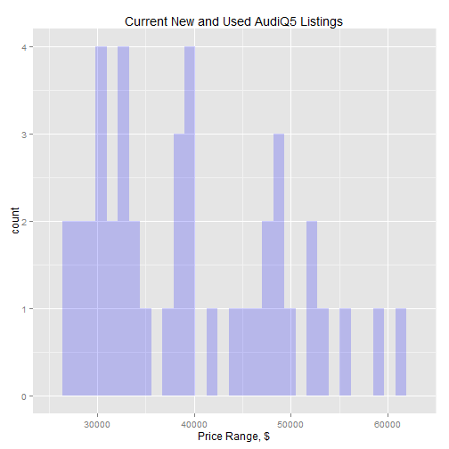
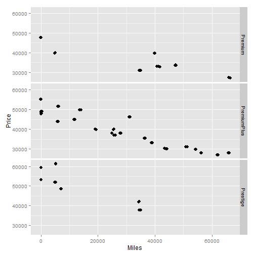
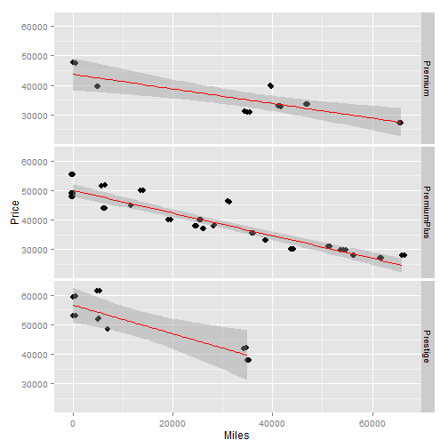

Q5pricetool
========================================================
author: spacejockey 
date: August 2015

Simplify finding a good car price
========================================================

The Q5price tool is a prototype that gives you:

- Capability to predict a likely and best price
- Exploratory graphs to cut through how features affect price
- Used and new car capability

The prototype:
- Focuses on the Q5 and has been used in a trial run
- Uses 43 datapoints manually collected late 2014
- Includes data on cars 2010-2015

Source Data: can be dynamic database
========================================================


```r
library(ggplot2)
library(shiny)
library(knitr)
dataset <- read.csv("data/Q5rawdata.csv", header=TRUE)
kable(head(dataset)[1:3,])
```


| Price| Miles| Year|Engine |Trim        |Color | Miles.Away|
|-----:|-----:|----:|:------|:-----------|:-----|----------:|
| 61417|  5273| 2014|A      |Prestige    |Scuba |        359|
| 59455|    42| 2015|B      |Prestige    |Black |        348|
| 55270|    18| 2014|A      |PremiumPlus |Gray  |        273|
Variables (columns) can change, but streamlined by statistical significance

Exploratory plots with many flexible views
========================================================
 
Across all listings
***

 
By any variable, add color or facets

Statistical model: significant variables
===
predicts price based on user inputs

```r
PriceFit <- lm(Price~Miles+Year+Trim+Engine, data=dataset)
kable(summary(PriceFit)$coef)
```


|                |      Estimate|   Std. Error|    t value| Pr(>&#124;t&#124;)|
|:---------------|-------------:|------------:|----------:|------------------:|
|(Intercept)     | -4.712727e+06| 9.097336e+05| -5.1803374|          0.0000086|
|Miles           | -1.970540e-01| 3.120170e-02| -6.3154926|          0.0000003|
|Year            |  2.366021e+03| 4.516694e+02|  5.2383914|          0.0000072|
|TrimPremiumPlus |  6.533943e+02| 9.113655e+02|  0.7169399|          0.4780372|
|TrimPrestige    |  7.222149e+03| 1.591772e+03|  4.5371765|          0.0000612|
|EngineB         | -5.716666e+03| 1.434853e+03| -3.9841486|          0.0003158|
|EngineC         | -6.453307e+03| 1.350067e+03| -4.7799912|          0.0000294|

Fits a Line to Spot Good Buys
===

Good buys are below the line
Hard NOT to get a good deal with this tool!


Your best price is:

```r
prediction
```

```
       1 
39283.86 
```
***
 
